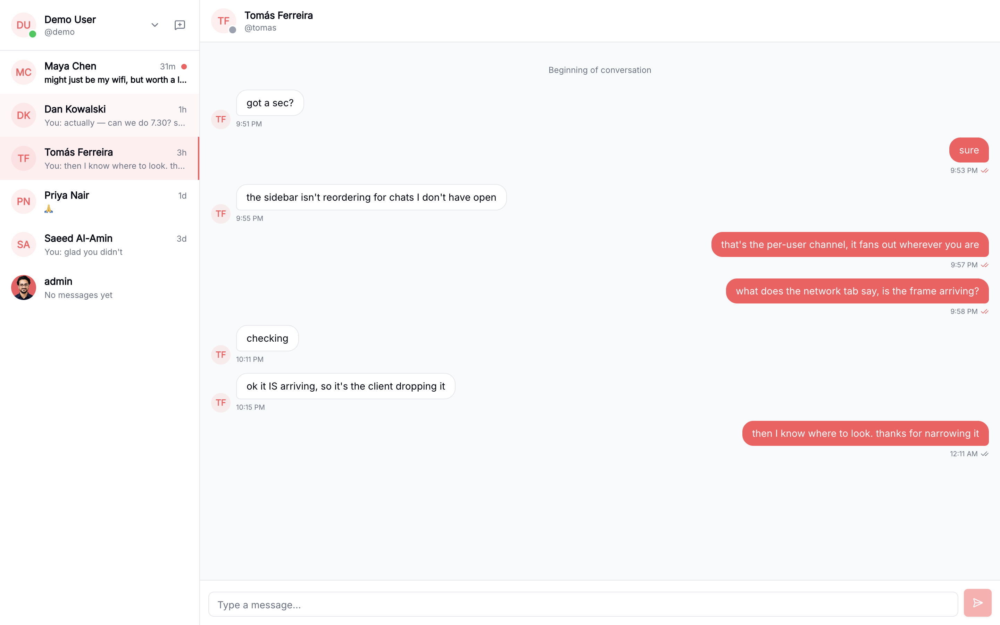
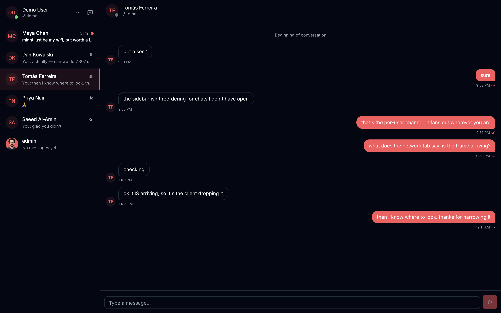

# Convo

Convo is a repository for a real-time chat platform frontend.

<p align="center">
  
</p>

<details>
<summary>Dark theme</summary>

<p align="center">
  
</p>

</details>

Messages arrive over a WebSocket, the sidebar reorders itself as they land, and
the ticks track each message from sent to delivered to read. Presence, typing
indicators and unread state all update without a refresh.

> Screenshots are of a local build running against seeded data — see
> [Seeing it with data in it](#seeing-it-with-data-in-it).

## Architecture

- `src/`: React frontend using Vite and Tailwind CSS.

## Documentation Map

- Project docs index: [`docs/index.md`](./docs/index.md)
- Backend docs: [`backend`](https://github.com/hedonarc/convo-backend/tree/main/docs)

- Frontend docs:
  - Setup: [`docs/frontend/setup.md`](./docs/frontend/setup.md)
  - Architecture: [`docs/frontend/architecture.md`](./docs/frontend/architecture.md)
  - State management: [`docs/frontend/state-management.md`](./docs/frontend/state-management.md)
  - Testing: [`docs/frontend/testing.md`](./docs/frontend/testing.md)

  ## Release & Versioning

  This project follows [Semantic Versioning](https://semver.org/) and [Conventional Commits](https://www.conventionalcommits.org/).
  - **Automation:**
    - **Frontend:** Automated via `semantic-release`.
  - **Commit Format:** `type(scope): description` (e.g., `feat(ui): add jwt integration`). Enforcement is handled via `pre-commit`.

  ## Quick Start

  For local setup, you can now use Turborepo to run everything concurrently:

1. Install all dependencies: `pnpm install`
2. Run development servers: `pnpm run dev`
3. Frontend docs: [`docs/frontend/setup.md`](./docs/frontend/setup.md)

## Seeing it with data in it

A fresh database gives you an empty sidebar, which makes it hard to tell
whether anything works. The backend ships a seeder that fills one with a cast
and conversations covering every visible state — unread, delivered, read,
edited, deleted, and empty:

```bash
cd ../convo-backend
make seed-fresh
```

Then log in as `demo` / `demo12345`. Every seeded peer shares that password, so
signing a second browser in as `maya` is enough to watch typing, presence and
receipts move between two live clients.

## Development and Contributing

- Global contribution standards: [`CONTRIBUTING.md`](./CONTRIBUTING.md)

## 🤝 Contributors

This project is developed by:

- **Abubakar Khawaja** — Full Stack Developer (React + Django)
- **Muhammad Suleman Butt** — Full Stack Developer (React / React Native + Django)
